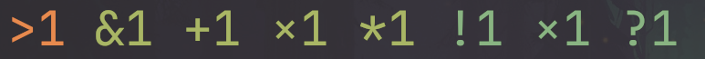
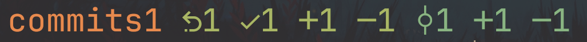
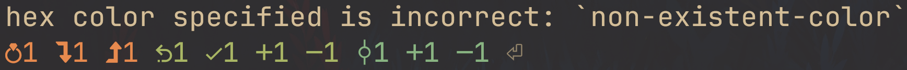

# Octussy
Yes, it's referring exactly to what you think it does.

This program is what I use to display git status in my shell prompt.

The way you use it is by putting the binary somewhere in your shell prompt, so it's executed.

In fish, that would be something like this:
```fish
function fish_prompt
	printf (pwd)' '
	octussy
end
```

By default, octussy will print this output to stdout (if you had every single type of change in your current git directory), without a newline at the end:

`octussy --test`


The meanings of every element in order:

1. Commits you haven't yet pushed to the remote
2. Staged renamed files
3. Staged modifications
4. Staged new files
5. Staged deletions
6. Unstaged modifications
7. Unstaged new files
8. Unstaged deletions

It uses nerd font symbols for some of the elements.

If you don't want to use a nerd font, use the `--ascii-symbols` flag:

`octussy --test --ascii-symbols`



Only the elements that are at least one are printed, making testing how octussy fully looks kinda annoying. That's why the `--test` flag exists – you get to see the entire output of octussy regardless of how many changes your current git directory actually has.

By default, unpushed commits are shown in yellow, staged changes in green, and unstaged changes in cyan, following your terminal's color scheme.

You can change each category's default to either one of these 8 colors:

black, red, green, yellow, blue, purple, cyan, white

`octussy --color-all-staged purple`


Or by providing a hex color: `octussy --color-all-staged AF87FF`


The cAsE of colors doesn't matter.

You can then override the default for specific elements, if you want to: `octussy --color-all-unstaged blue --color-deleted red`


Same thing applies to the glyphs used: `octussy --symbol-unpushed 󰤇 --symbol-deleted 󱇪`


Interestingly, you're not restricted to a single character. So it could be a whole word, if you want to!: `octussy --symbol-unpushed commits`



A similar thing happens for colors: `octussy --color-staged-deleted '87FF5F this is my brigher green that I want to use for this element'`


Despite putting an entire sentence into the flag, only the hex color is used, ignoring all other text. You can use this behavior as a comment. Doesn't work with word colors (like `green`, `red`, etc).

Since this program is something you're going to use in your shell prompt, it doesn't print error messages by default. If something isn't working correctly, use the `-v`/`--verbose` flag interactively to check what's wrong:

`octussy -v --test --color-unstaged 'non-existent-color'`



In other words, your prompt will still continue to work via using defaults, if there are any errors.

This prevents you from having a broken shell prompt because you specified an incorrect argument, for example.

## Usage

```
A simple executable git status for your shell prompt

Usage: octussy [OPTIONS]

Options:
  -v, --verbose
          octussy doesn't print errors by default, because it's supposed to be in your shell prompt constantly.
          
          When you do want to see the errors, use this flag.

      --ascii-symbols
          octussy uses nerd font symbols for some elements by default.
          
          Use this flag if you don't use a nerd font.
          
          You can see both the nerd and ascii defaults for every category later down in this help.

      --test
          Will print every single element.
          
          Helpful for testing the output without having to be in a git directory with certain changes.

      --color-unpushed <COLOR_UNPUSHED>
          [default: yellow]
          
          For every color, you can either specify one of the main 8 colors from your terminal color scheme:
          
          black, red, green, yellow, blue, purple, cyan, white
          
          Or a hex code, without the # symbol like: FFAFD7
          
          For both hex codes and color names, the cAsE doesn't matter

      --color-all-staged <COLOR_ALL_STAGED>
          [default: green]

      --color-all-unstaged <COLOR_ALL_UNSTAGED>
          [default: cyan]

      --color-renamed <COLOR_RENAMED>
          [default: --color-all-staged]

      --color-staged <COLOR_STAGED>
          [default: --color-all-staged]

      --color-added <COLOR_ADDED>
          [default: --color-all-staged]

      --color-staged-deleted <COLOR_STAGED_DELETED>
          [default: --color-all-staged]

      --color-modified <COLOR_MODIFIED>
          [default: --color-all-unstaged]

      --color-unstaged <COLOR_UNSTAGED>
          [default: --color-all-unstaged]

      --color-deleted <COLOR_DELETED>
          [default: --color-all-unstaged]

      --symbol-unpushed <SYMBOL_UNPUSHED>
          [default:  or >]

      --symbol-renamed <SYMBOL_RENAMED>
          [default: 󰕍 or &]

      --symbol-staged <SYMBOL_STAGED>
          [default: 󰄬 or !]

      --symbol-added <SYMBOL_ADDED>
          [default: 󰐕 or +]

      --symbol-staged-deleted <SYMBOL_STAGED_DELETED>
          [default: 󰍴 or -]

      --symbol-modified <SYMBOL_MODIFIED>
          [default:  or !]

      --symbol-unstaged <SYMBOL_UNSTAGED>
          [default: 󰐕 or +]

      --symbol-deleted <SYMBOL_DELETED>
          [default: 󰍴 or -]

  -h, --help
          Print help (see a summary with '-h')

  -V, --version
          Print version
```

## Install

With binstall, if you have it:
```
cargo binstall octussy
```

With default cargo, if you don't:
```
cargo install octussy
```